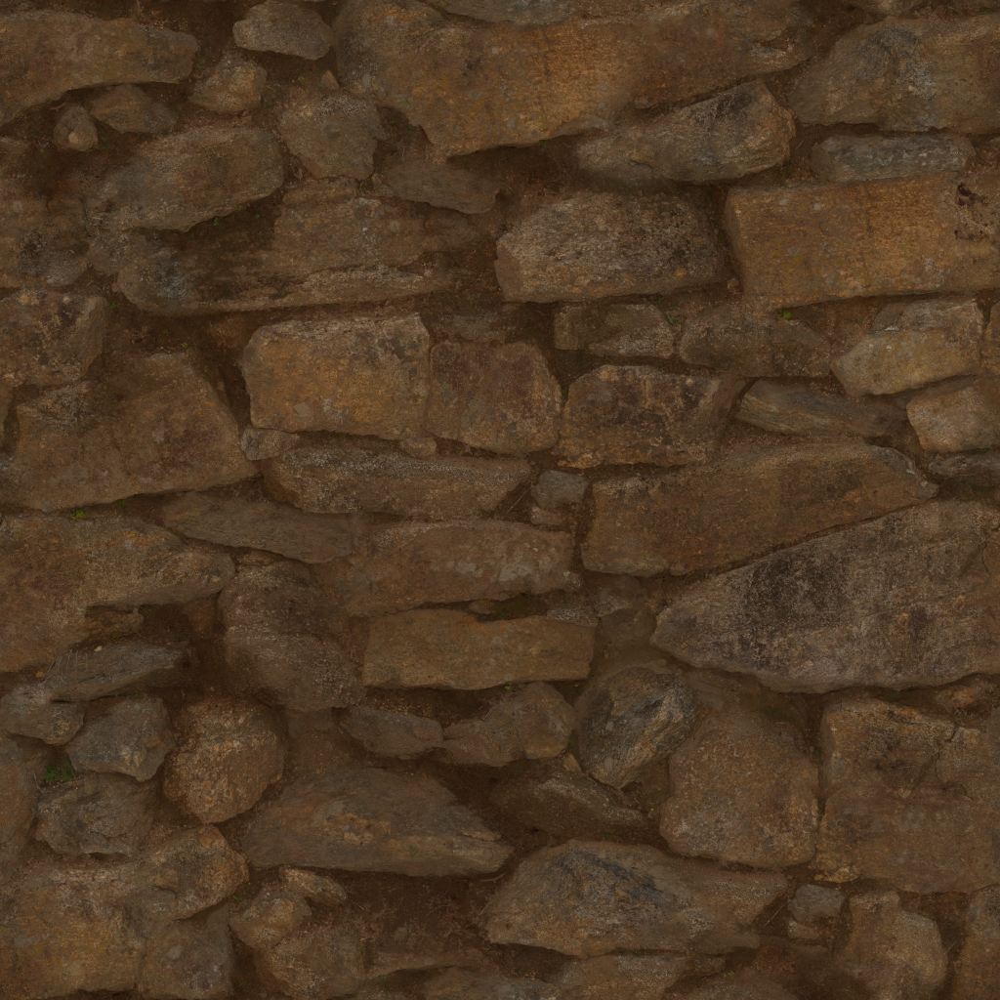
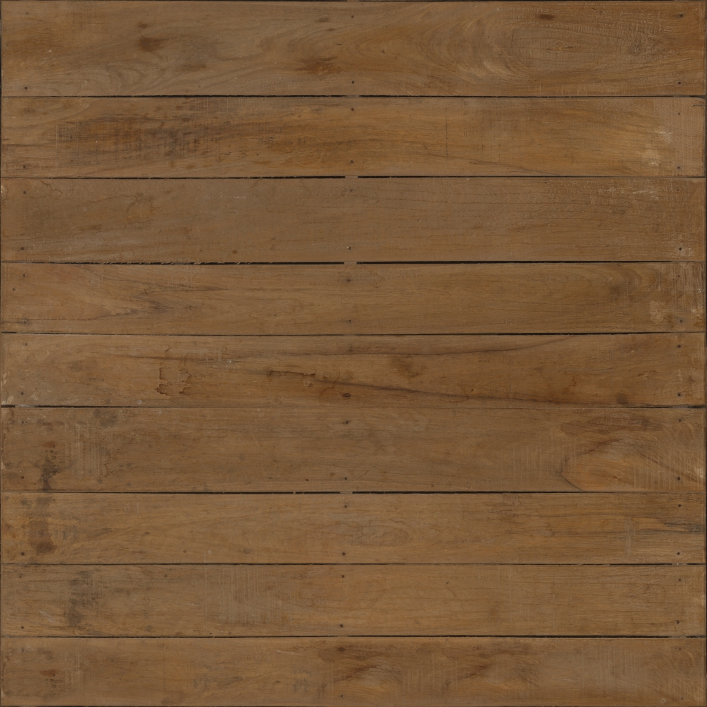
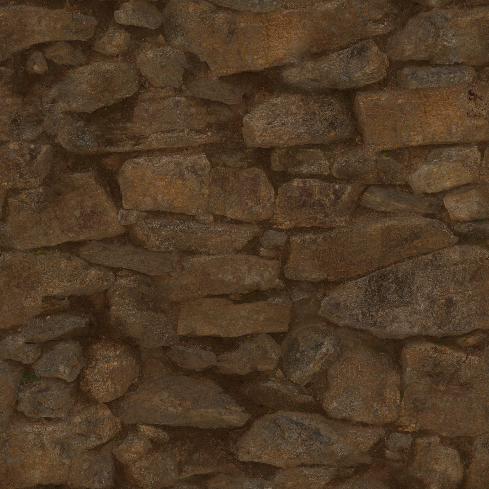
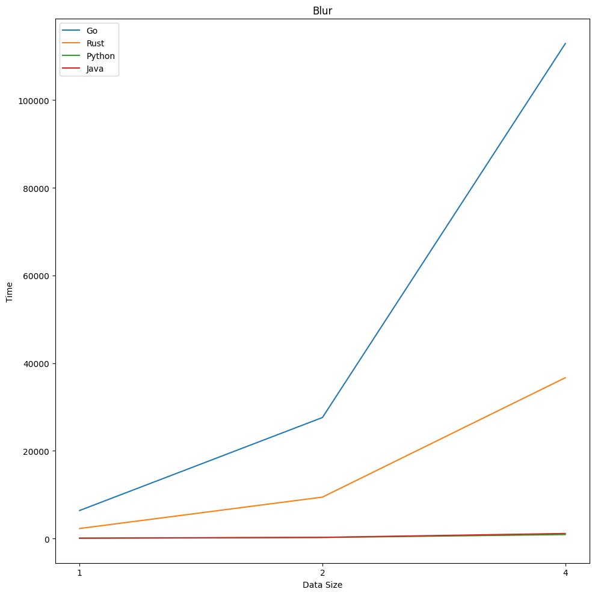
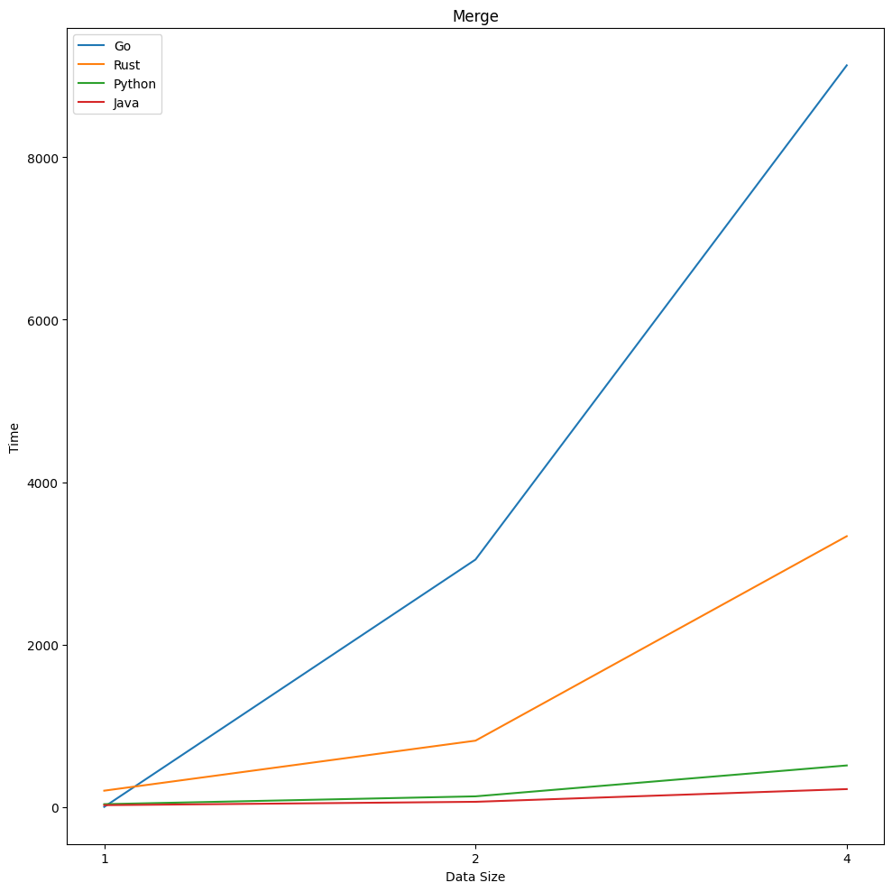
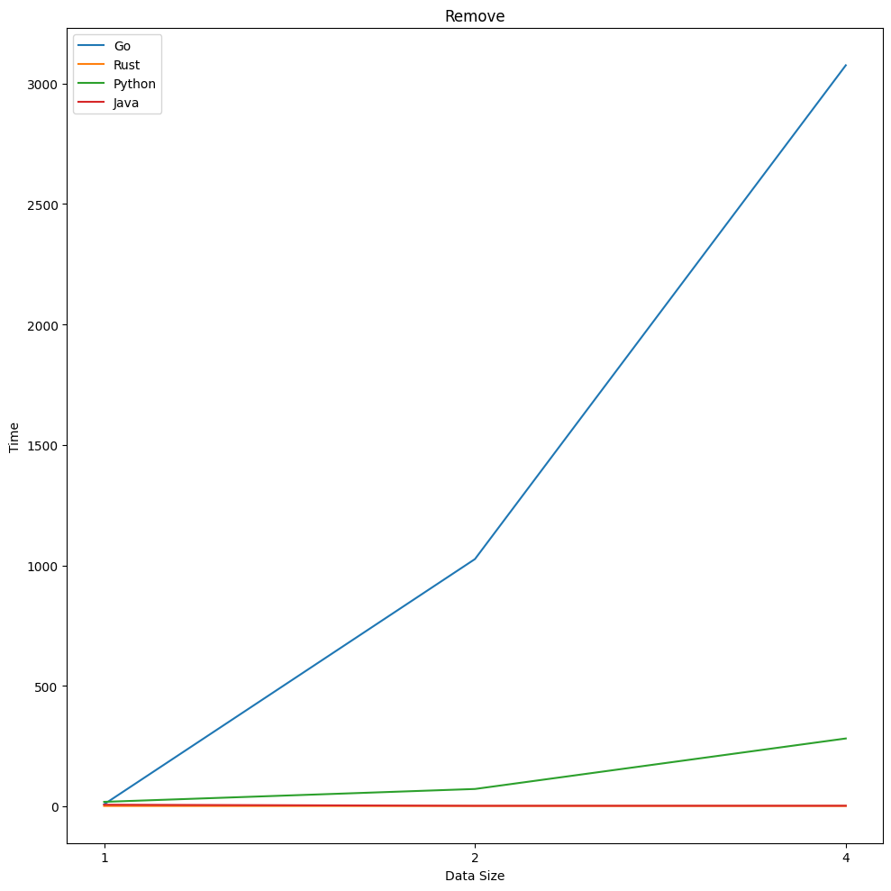

# Final Report

## Project info

- Project type: `Image Processing`
- Members with assaigments:
  - project/work organization: Michał Joński
  - reporting: Mykyta Husar
  - code repository maintance: Piotr Karczmarczyk, Michał Joński
  - coding: Damian Kantorowski, Piotr Karczmarczyk, Michał Joński, Mykyta Husar
- Link to github (though it's private):
<https://github.com/Mikulej/Image-Processing>
- Problem: The challenge we faced was in the field of `image processing`. Our task was to develop a software solution that could perform several specific tasks. These included the ability to combine two separate images into one, apply a blurring effect to an image, and remove specific shapes (such as squares or circles) from an image. The goal was to create similiar code for these tasks in 4 diffrent programming languages and compare their speed and weight
- Used languages:
  - **Golang** 🐹
  - **Java** ☕
  - **Rust** 🦀
  - **Python** 🐍

## Algorithms presentation

### Algorithms

#### **Gaussian Blur** _(Blur)_

This is a widely used effect in graphics software, typically to reduce image noise and reduce detail. It is the result of blurring an image by a Gaussian function (named after mathematician and scientist Carl Friedrich Gauss). Each pixel’s new value is set to a weighted average of that pixel’s neighborhood. The original pixel’s value receives the heaviest weight (having the highest Gaussian value) and neighboring pixels receive smaller weights as their distance to the original pixel increases.

Complexity: O(n^2), where n is the number of input pixels.

#### **Alpha Compositing** _(Merge)_

In computer graphics, alpha compositing or alpha blending is the process of combining one image with a background to create the appearance of partial or full transparency. It is often useful to render picture elements (pixels) in separate passes or layers and then combine the resulting 2D images into a single, final image called the composite. Each pixel in the image gets multiplied by the Gaussian kernel.

Complexity: O(n), where n is the number of input pixels. The blending operation for each pixel involves simple arithmetic operations, and they are performed independently.

#### **Shape Remove** _(Remove)_

This is not a standard algorithm, but it could refer to a process that removes a specific shape (like a square or circle) from an image. The specifics of this process can vary, but it might involve identifying the shape based on certain parameters (like size), and then replacing the pixels within that shape with some other value (like the background color). This could be achieved by using morphological operations or line simplification algorithms.

Complexity: O(n), where n is the size in pixels of the shape.

### AI

#### GO(lang)

- `GitHub Copilot`:
  - create here an export function to read images, this function will run other functions defined specificly to the format, this function will return pixel struct (rgb):

    ```go
    package main

    import (
        "image"
        "os"
    )

    type Pixel struct {
        R, G, B uint8
    }

    func ReadImage(filepath string) ([]Pixel, error) {
        file, err := os.Open(filepath)
        if err != nil {
            return nil, err
        }
        defer file.Close()

        img, _, err := image.Decode(file)
        if err != nil {
            return nil, err
        }

        bounds := img.Bounds()
        width, height := bounds.Max.X, bounds.Max.Y

        pixels := make([]Pixel, 0, width*height)

        for y := 0; y < height; y++ {
            for x := 0; x < width; x++ {
                r, g, b, _ := img.At(x, y).RGBA()
                pixel := Pixel{uint8(r >> 8), uint8(g >> 8), uint8(b >> 8)}
                pixels = append(pixels, pixel)
            }
        }

        return pixels, nil
    }

    func main() {
        pixels, err := ReadImage("path/to/image.jpg")
        if err != nil {
            panic(err)
        }

        // Use the pixels...
    }
    ```

  - create here function that will take path to file and 2 dimention slice of Pixel struct and will save that as image:

    ```go
    func SaveImage(filepath string, pixels [][]Pixel) error {
        height := len(pixels)
        width := len(pixels[0])

        img := image.NewRGBA(image.Rect(0, 0, width, height))

        for y := 0; y < height; y++ {
            for x := 0; x < width; x++ {
                pixel := pixels[y][x]
                img.Set(x, y, color.RGBA{uint8(pixel.R >> 8),
                    uint8(pixel.G >> 8),
                    uint8(pixel.B >> 8),
                    uint8(pixel.A >> 8)})
            }
        }

        file, err := os.Create(filepath)
        if err != nil {
            return err
        }
        defer file.Close()

        err = png.Encode(file, img)
        if err != nil {
            return err
        }
    ```

  - Write here Gaussian blur function, arguments: 1) color.Color 2) ksize (kernel size tuple of 2 inegers) 3) sigma (tuple of 2 floats) 4) btype (border type BORDER_CONSTANT BORDER_REPLICATE BORDER_REFLECT BORDER_WRAP BORDER_REFLECT_101 BORDER_TRANSPARENT BORDER_REFLECT101 BORDER_DEFAULT BORDER_ISOLATED):

    ```go
    import (
        "image"
        "image/color"
        "math"
    )

    func GaussianBlur(img []color.Color,
        ksize image.Point,
        sigma image.Point,
        btype int) []color.Color {
        // Perform Gaussian blur operation on the image slice
        // ...

        return img
    }

    type BorderType int

    const (
        BORDER_CONSTANT       BorderType = iota // Border is filled with
                                                // a constant value
        BORDER_REPLICATE                        // Border is replicated
                                                // from the edge pixels
        BORDER_REFLECT                          // Border is reflected
                                                // across the edge pixels
        BORDER_WRAP                             // Border is wrapped around
                                                // to the opposite edge
        BORDER_REFLECT_101                      // Border is reflected across
                                                // the edge pixels with
                                                // a slight change
        BORDER_TRANSPARENT                      // Border is transparent
        BORDER_REFLECT101                       // Border is reflected across
                                                // the edge pixels with
                                                // a slight change
        BORDER_DEFAULT                          // Default border type
        BORDER_ISOLATED                         // Border is isolated
    )
    ```

  - implement here complex version of Guassian blur algorithm, that will use all arguments of the function and have specific realisation for every border type. Here is the description for each border: BORDER_CONSTANT: This border type pads the image with a constant value (0 by default). This means that the border will appear as if it’s a solid color. BORDER_REPLICATE: This border type replicates the edge pixels. Essentially, it pads the border of the image with the same color as the edge of the image. BORDER_REFLECT: This border type reflects the border elements in reverse order. For instance, if the image border is “abcdef”, it will be reflected as “fedcba”. BORDER_WRAP: Unfortunately, I couldn’t find specific information on this border type. BORDER_REFLECT_101: This border type reflects the border elements in reverse order, just like BORDER_REFLECT, but with a slight change. The exact edge pixel is not duplicated. So, if the image border is “abcdef”, it will be reflected as “gfedcb”. BORDER_TRANSPARENT: Unfortunately, I couldn’t find specific information on this border type. BORDER_REFLECT101: This is the same as BORDER_REFLECT_101. BORDER_DEFAULT: This is the same as BORDER_REFLECT_101. BORDER_ISOLATED: This border type does not consider pixels outside the region of interest for border interpolation.:

    ```go
    width := kernel_size[0]
            height := kernel_size[1]
            kernel := generateGaussianKernel(kernel_size, sigma)

            blurredImg := make([]color.Color, len(img))
            copy(blurredImg, img)

            for y := 0; y < len(img); y++ {
                for x := 0; x < len(img[y]); x++ {
                    var r, g, b, a float64
                    var weightSum float64

                    for ky := -int(height) / 2; ky <= int(height)/2; ky++ {
                        for kx := -int(width) / 2; kx <= int(width)/2; kx++ {
                            px := x + kx
                            py := y + ky

                            switch border_type {
                            case BORDER_CONSTANT:
                                if px < 0 || px >= len(img[y])
                                    || py < 0 || py >= len(img) {
                                    r += kernel[ky+int(height)/2][kx+int(width)/2] 
                                        * 0
                                    g += kernel[ky+int(height)/2][kx+int(width)/2] 
                                        * 0
                                    b += kernel[ky+int(height)/2][kx+int(width)/2] 
                                        * 0
                                    a += kernel[ky+int(height)/2][kx+int(width)/2] 
                                        * 0
                                } else {
                                    pixel := img[py][px]
                                    r += kernel[ky+int(height)/2][kx+int(width)/2] 
                                        * float64(pixel.R)
                                    g += kernel[ky+int(height)/2][kx+int(width)/2] 
                                        * float64(pixel.G)
                                    b += kernel[ky+int(height)/2][kx+int(width)/2] 
                                        * float64(pixel.B)
                                    a += kernel[ky+int(height)/2][kx+int(width)/2] 
                                        * float64(pixel.A)
                                }
                            case BORDER_REPLICATE:
                                px = int(math.Min(math.Max(float64(px), 0),
                                    float64(len(img[y])-1)))
                                py = int(math.Min(math.Max(float64(py), 0),
                                    float64(len(img)-1)))
                                pixel := img[py][px]
                                r += kernel[ky+int(height)/2][kx+int(width)/2]
                                    * float64(pixel.R)
                                g += kernel[ky+int(height)/2][kx+int(width)/2]
                                    * float64(pixel.G)
                                b += kernel[ky+int(height)/2][kx+int(width)/2]
                                    * float64(pixel.B)
                                a += kernel[ky+int(height)/2][kx+int(width)/2]
                                    * float64(pixel.A)
                            case BORDER_REFLECT:
                                px = reflectBorderCoordinate(px, len(img[y]))
                                py = reflectBorderCoordinate(py, len(img))
                                pixel := img[py][px]
                                r += kernel[ky+int(height)/2][kx+int(width)/2] *
                                    float64(pixel.R)
                                g += kernel[ky+int(height)/2][kx+int(width)/2] *
                                    float64(pixel.G)
                                b += kernel[ky+int(height)/2][kx+int(width)/2] *
                                    float64(pixel.B)
                                a += kernel[ky+int(height)/2][kx+int(width)/2] *
                                    float64(pixel.A)
                            case BORDER_WRAP:
                                px = wrapBorderCoordinate(px, len(img[y]))
                                py = wrapBorderCoordinate(py, len(img))
                                pixel := img[py][px]
                                r += kernel[ky+int(height)/2][kx+int(width)/2] *
                                    float64(pixel.R)
                                g += kernel[ky+int(height)/2][kx+int(width)/2] *
                                    float64(pixel.G)
                                b += kernel[ky+int(height)/2][kx+int(width)/2] *
                                    float64(pixel.B)
                                a += kernel[ky+int(height)/2][kx+int(width)/2] *
                                    float64(pixel.A)
                            case BORDER_REFLECT_101:
                                px = reflect101BorderCoordinate(px, len(img[y]))
                                py = reflect101BorderCoordinate(py, len(img))
                                pixel := img[py][px]
                                r += kernel[ky+int(height)/2][kx+int(width)/2] *
                                    float64(pixel.R)
                                g += kernel[ky+int(height)/2][kx+int(width)/2] *
                                    float64(pixel.G)
                                b += kernel[ky+int(height)/2][kx+int(width)/2] *
                                    float64(pixel.B)
                                a += kernel[ky+int(height)/2][kx+int(width)/2] *
                                    float64(pixel.A)
                            case BORDER_TRANSPARENT:
                                // Handle transparent border type
                                // Add your implementation here
                            case BORDER_REFLECT101:
                                px = reflect101BorderCoordinate(px, len(img[y]))
                                py = reflect101BorderCoordinate(py, len(img))
                                pixel := img[py][px]
                                r += kernel[ky+int(height)/2][kx+int(width)/2] *
                                    float64(pixel.R)
                                g += kernel[ky+int(height)/2][kx+int(width)/2] *
                                    float64(pixel.G)
                                b += kernel[ky+int(height)/2][kx+int(width)/2] *
                                    float64(pixel.B)
                                a += kernel[ky+int(height)/2][kx+int(width)/2] *
                                    float64(pixel.A)
                            case BORDER_DEFAULT:
                                px = reflect101BorderCoordinate(px, len(img[y]))
                                py = reflect101BorderCoordinate(py, len(img))
                                pixel := img[py][px]
                                r += kernel[ky+int(height)/2][kx+int(width)/2] *
                                    float64(pixel.R)
                                g += kernel[ky+int(height)/2][kx+int(width)/2] *
                                    float64(pixel.G)
                                b += kernel[ky+int(height)/2][kx+int(width)/2] *
                                    float64(pixel.B)
                                a += kernel[ky+int(height)/2][kx+int(width)/2] *
                                    float64(pixel.A)
                            case BORDER_ISOLATED:
                                // Handle isolated border type
                                // Add your implementation here
                            }
                            weightSum += kernel[ky+int(height)/2][kx+int(width)/2]
                        }
                    }

                    r /= weightSum
                    g /= weightSum
                    b /= weightSum
                    a /= weightSum

                    blurredImg[y][x] = color.RGBA{
                        R: uint8(math.Round(r)),
                        G: uint8(math.Round(g)),
                        B: uint8(math.Round(b)),
                        A: uint8(math.Round(a)),
                    }
                }
            }

            return blurredImg, nil
        }

        func reflectBorderCoordinate(coord, length int) int {
            if coord < 0 {
                return -coord
            }
            if coord >= length {
                return 2*length - coord - 2
            }
            return coord
        }

        func wrapBorderCoordinate(coord, length int) int {
            if coord < 0 {
                return length + coord%length
            }
            if coord >= length {
                return coord % length
            }
            return coord
        }

        func reflect101BorderCoordinate(coord, length int) int {
            if coord < 0 {
                return -coord - 1
            }
            if coord >= length {
                return 2*length - coord - 1
            }
            return coord
        }
    ```

- `GPT4`:
  - List the type of borders in Gaussian Blur:

    ```text
    BORDER_CONSTANT: This border type pads the image with a constant value (0 by default).
    This means that the border will appear as if it’s a solid color.
    BORDER_REPLICATE: This border type replicates the edge pixels.
    Essentially, it pads the border
    of the image with the same color as the edge of the image.
    BORDER_REFLECT: This border type reflects the border elements in reverse order.
    For instance, if the image border is “abcdef”, it will be reflected as “fedcba”.
    BORDER_WRAP: Unfortunately, I couldn’t find specific information on this border type.
    BORDER_REFLECT_101: This border type reflects the border elements in reverse order,
    just like BORDER_REFLECT, but with a slight change.
    The exact edge pixel is not duplicated.
    So, if the image border is “abcdef”, it will be reflected as “gfedcb”.
    BORDER_TRANSPARENT: Unfortunately, I couldn’t find specific information
    on this border type.
    BORDER_REFLECT101: This is the same as BORDER_REFLECT_101.
    BORDER_DEFAULT: This is the same as BORDER_REFLECT_101.
    BORDER_ISOLATED: This border type does not consider pixels
    outside the region of interest for border interpolation.
    ```

  - does this golang code is a valid Gaussian blur algorithm?:"

    ```go

        for y := kernel_size[0]; y < len(workSpace)-kernel_size[0]; y++ {
            for x := kernel_size[1]; x < len(workSpace[y])-kernel_size[1]; x++ {
                sumR, sumG, sumB := 0.0, 0.0, 0.0
                weightSum := 0.0

                for ky := -kernel_size[0]; ky <= kernel_size[0]; ky++ {
                    for kx := -kernel_size[1]; kx <= kernel_size[1]; kx++ {
                        gaussianWeight := math.Exp(-(float64(kx*kx)/(2*sigma[0]*sigma[0]) +
                        float64(ky*ky)/(2*sigma[1]*sigma[1])))
                        weightSum += gaussianWeight

                        sumR += float64(workSpace[y+ky][x+kx].R) * gaussianWeight
                        sumG += float64(workSpace[y+ky][x+kx].G) * gaussianWeight
                        sumB += float64(workSpace[y+ky][x+kx].B) * gaussianWeight
                    }
                }

                workSpace[y][x].R = uint8(sumR / weightSum)
                workSpace[y][x].G = uint8(sumG / weightSum)
                workSpace[y][x].B = uint8(sumB / weightSum)
            }
        }
    ```

  ", because here kernel is doubled, does it should be like that?:

    ```text
    The Gaussian blur algorithm you've provided seems to be correct.
    The kernel size is indeed doubled, but this is intentional. 

    In a Gaussian blur, the kernel size determines the area around each pixel
    that will be used to calculate the blur. This area is often a square
    (for 2D images) and the pixel in question is at the center.
    So, if you have a kernel size of `k`, you're looking at `k` pixels above,
    `k` pixels below, `k` pixels to the left, and `k` pixels
    to the right of the current pixel. This is why the kernel size
    is effectively doubled.

    The code you've provided seems to correctly implement this.
    It iterates over each pixel in the image
    (excluding a border of width `kernel_size`), and for each pixel,
    it calculates a weighted average of the colors of the pixels
    in the surrounding area. The weights are determined by the Gaussian function,
    which depends on the distance from the center pixel.

    The resulting sums are then divided by the total weight to get the average,
    and these averages are used as the new color values for the pixel.
    This is the essence of the Gaussian blur algorithm.

    So, to answer your question, yes,
    the kernel size should be doubled in this context.
    It's a common practice in implementing Gaussian blur.
    However, please note that the actual kernel size
    (i.e., the width and height of the square area used for the blur)
    is `2*kernel_size + 1`, because the kernel includes the center pixel as well.
    For example, if `kernel_size` is 1, the actual kernel size is 3
    (1 pixel above, the center pixel, and 1 pixel below).
    If `kernel_size` is 2, the actual kernel size is 5, and so on.
    This might be a point of confusion, so I hope this explanation helps!
    ```

  - i have command line application, please create a powershell script to check a mean time of execution of the programm, this program take specific parameters "-i path1 -o path2", and you should calculate mean after 50 times running programm, please create separate variables for times the programm is running and the path to this programm:

    ```powershell
    # Define the path to the program
    $programPath = "YourProgram.exe"

    # Define the input and output parameters
    $param1 = "-i path1"
    $param2 = "-o path2"

    # Define the number of times the program will be run
    $timesToRun = 50

    # Initialize a variable to store the total execution time
    $totalTime = 0

    # Run the program the specified number of times
    for ($i = 0; $i -lt $timesToRun; $i++) {
        # Get the current time
        $startTime = Get-Date

        # Run the program with the specified parameters
        & $programPath $param1 $param2

        # Calculate the execution time
        $executionTime = ((Get-Date) - $startTime).TotalMilliseconds

        # Add the execution time to the total time
        $totalTime += $executionTime
    }

    # Calculate the mean execution time
    $meanTime = $totalTime / $timesToRun

    # Output the mean execution time
    Write-Output "Mean execution time: $meanTime ms"
    ```

#### Java

`None`

#### Rust

- `GitHub Copilot`:
  - get path to awesomeface.png:

    ```rust
    use std::env;

    fn main() {
        let current_dir = env::current_dir().expect("Failed to get current directory");
        let image_path = current_dir.join("awesomeface.png");
        
        // Use the image_path variable in your code
        // ...
    }
    ```

  - how to add rust crate to my program:

    ```rust
    [package]
    name = "my_project"
    version = "0.1.0"
    edition = "2018"

    [dependencies]
    image = "0.23.14"
    ```

  - create function to save image:

    ```rust
    use image::GenericImageView;

    fn save_image(image: &DynamicImage, path: &str) {
        image
            .save(path)
            .expect("Failed to save image");
    }
    ```

  - How do i pass parameters to main function?:

    ```rust
    fn main() {
    let args: Vec<String> = std::env::args().collect();
    println!("{:?}", args);
    }
    ```

  - check size of args:

    ```rust
    if args.len() < 3 {
        panic!("Not enough arguments. Expected path to image1, path to image2,
        and operation (r, m, b).");
    }
    ```

  - use args[0] in match statement:

    ```rust
    let mode = &args[1];
    match mode.as_str() {
        "r" => {}, //removal
        "m" => {}, //merge
        "b" => {}, //blur
        _ => panic!("Invalid operation. Expected 'r', 'm', or 'b'."),
    }
    ```

  - how to print variable inside of println!:

    ```rust
    let num_args = args.len();
    println!("Number of arguments passed: {}", num_args);
    ```

  - how to get path of 2 pictures in images folder;
  what if i dont know the names of the images:

    ```rust
    use std::fs;

    fn main() {
        let paths = fs::read_dir("./images").unwrap();

        let mut image_paths = Vec::new();

        for path in paths {
            let path_str = path.unwrap().path().display().to_string();
            if path_str.ends_with(".png") {
                image_paths.push(path_str);
            }
        }

        println!("{:?}", image_paths);
    }
    ```

  - how to change rgba pixel data:

    ```rust
    let pixel = img.get_pixel(x, y);
    let mut new_pixel = pixel.to_rgba();
    new_pixel[0] = 255; // Set the red channel to its maximum value
    img.put_pixel(x, y, image::Rgba(new_pixel));
    ```

  - iterate throught all pixel channels:

    ```rust
    for (x, y, pixel) in img.enumerate_pixels_mut() {
        for channel in pixel.channels_mut() {
            // Manipulate channel here
        }
    }
    ```

  - code for merging two images based on ratio of two images:

    ```rust
    for (x, y, pixel) in img.enumerate_pixels() {
        let mut pixel1 = *pixel;
        let mut pixel2 = *img2.get_pixel(x, y);
        for (channel1, channel2) in pixel1.channels_mut().iter_mut().zip(pixel2.channels()
            .iter()) {
            *channel1 = ((*channel1 as f32 * ratio1) + (*channel2 as f32 * ratio2)) as u8;
        }
        img.put_pixel(x, y, pixel1);
    }
    ```

  - How can I state that my variable mergedPixel represents Rgba:

    ```rust
    let mut mergedPixel: image::Rgba<u8> = image::Rgba([0, 0, 0, 0]);
    ```

  - iterate by every third args:

    ```rust
    for arg in args.iter().step_by(3) {
        // Use arg here
    }
    ```

  - How to check if arg is out of bound:

    ```rust
    if let Some(arg) = args.get(index) {
        // Use arg here
    } else {
        // Handle the case where the index is out of bounds
    }
    ```

  - In one loop get args[i],args[i+1],args[i+2]:

    ```rust
    for i in (1..args.len()).step_by(3) {
        if let Some(arg1) = args.get(i) {
            if let Some(arg2) = args.get(i + 1) {
                if let Some(arg3) = args.get(i + 2) {
                    // Use arg1, arg2, and arg3 here
                } else {
                    // Handle the case where i + 2 is out of bounds
                }
            } else {
                // Handle the case where i + 1 is out of bounds
            }
        } else {
            // Handle the case where i is out of bounds
        }
    }

    "s" =>{//square
        let x = arg2.parse::<u32>().unwrap();
        let y = arg3.parse::<u32>().unwrap();
        for i in x..(x+100){
            for j in y..(y+100){
                imgbuf.put_pixel(i, j, image::Rgba([0, 0, 0, 0]));
            }
        }
        imgbuf.save("out/out.png").unwrap();

    },
    "c" =>{//circle
        let x = arg2.parse::<u32>().unwrap();
        let y = arg3.parse::<u32>().unwrap();
        for i in x..(x+100){
            for j in y..(y+100){
                if (i-x)*(i-x) + (j-y)*(j-y) <= 10000{
                    imgbuf.put_pixel(i, j, image::Rgba([0, 0, 0, 0]));
                }
            }
        }
        imgbuf.save("out/out.png").unwrap();

    },
    _=> panic!("Invalid shape. Expected 's' or 'c'."),
    ```

  - get total time of each loop:

    ```rust
    for _ in 0..12 {
        let start = std::time::Instant::now();
        // Your action here
        let end = std::time::Instant::now();
        let totalTime = end.duration_since(start);
        println!("Time elapsed: {:?}", totalTime);
    }
    ```

  - sum it up for all 12 iterations:

    ```rust
    let mut total_time = std::time::Duration::new(0, 0);
    for _ in 0..12 {
        let start = std::time::Instant::now();
        // Your action here
        let end = std::time::Instant::now();
        let elapsed_time = end.duration_since(start);
        total_time += elapsed_time;
    }
    println!("Total time elapsed: {:?}", total_time);
    ```

#### Python

Just `GitHub Copilot` autocomplete.

#### Comparing table of AI usage

| Language  | GitHub Copilot    | GPT4          | Percent of generated code | Percent of refactor the generated |
| --------  | --------------    | ----          | ------------------------- | ---|
| Python    | autocomplete      | none          | ~30%                      | 20% |
| Java      | none              | none          | 0%                        | 0%  |
| Rust      | prompts           | none          | ~30%                      | 40% |
| GOlang    | prompts           | information   | ~40%                      | 60% |

#### Gain of usage

In our development process, we leveraged the power of artificial intelligence to streamline and expedite the process. AI assisted us in automating repetitive tasks, identifying patterns, and even predicting potential issues, thereby simplifying the overall development process. Moreover, for those of us who are working with a new programming language for the first time, AI provides a quick start.

#### Small or long promts

When using GitHub Copilot, the complexity of the prompt often correlates with the complexity of the desired output. For a not long and heavily complex code structures and logic, a simple prompt or even multiple simple prompts can suffice. However, for longer and more complex code structures, the prompt should be more detailed and complex. This is because Copilot tends to lose context quickly when dealing with complex tasks. Therefore, providing a comprehensive and context-rich prompt can help guide Copilot to generate the desired complex code output.

## Evaluation data

- 1k.jpg:
  - Resolution: 1024x1024
  - Content: some rocks
  - Size: 788,480B
  - 
- 1k_a.jpg:
  - Resolution: 1024x1024
  - Content: some woods
  - Size: 610,304B
  - 
- 2k.jpg:
  - Resolution: 2048x2048
  - Content: some rocks
  - Size: 3,202,048B
  - 
- 2k_a.jpg:
  - Resolution: 2048x2048
  - Content: some woods
  - Size: 2,387,968B
  - 
- 4k.jpg:
  - Resolution: 4096x4096
  - Content: some rocks
  - Size: 12,417,024B
  - 
- 4k_a.jpg:
  - Resolution: 4096x4096
  - Content: some woods
  - Size: 9,032,704B
  - 

## Algorithms implementation

- AI used in entire project:
  - `GitHub Copilot`
  - `GPT4`
- Usage of AI:
  - ask to write a chunk of code and then finish it by yourself
  - feel yourself more comfortable in new environment
  - AI makes less errors in routine jobs, like loops

## Analysis of the results

### Blur



### Merge



### Remove



### Note

The Rust and Golang code was written from scratch, which means it was developed without the use of any existing libraries. As a result, its performance may not be as efficient as that of some libraries that parallelize computations on highly optimized code. This has nothing to do with artificial intelligence; it’s simply that our straightforward code is less optimized than popular libraries.

In terms of performance, Rust’s optimized code outperforms Golang’s in many metrics. However, the specific algorithm used for blurring in Rust must make a lot more calls to the API. This factor makes Golang faster for this particular algorithm (if the kernel size is the same).

## Conclusion

The project is done... We gained new experience while worked with new technologies.

About AI, we think that it is worth to use. In our team, we used AI as a handy tool in our programming tasks. It’s useful for quickly getting up to speed with new languages, keeping our routines organized, and spotting things we might have missed. It’s a simple, yet effective aid in our day-to-day work.

From our expierence to enhance the output of AI models, providing ample context is crucial. The more context a user provides, the better the AI can understand the task at hand and generate a more accurate and relevant result.

## Bibliography

1. <https://en.wikipedia.org/wiki/Gaussian_blur>
1. <https://en.wikipedia.org/wiki/Alpha_compositing>
1. <https://en.wikipedia.org/wiki/Go_(programming_language)>
1. <https://go.dev/>
1. <https://en.wikipedia.org/wiki/Rust_(programming_language)>
1. <https://www.rust-lang.org/>
1. <https://en.wikipedia.org/wiki/Python_(programming_language)>
1. <https://pypi.org/project/pillow/>
1. <https://pypi.org/project/opencv-python/>
1. <https://www.python.org/>
1. <https://en.wikipedia.org/wiki/Java_(programming_language)>
1. <https://www.java.com/en/>
1. <https://github.com/features/copilot>
1. <https://copilot.microsoft.com/>
1. <https://polyhaven.com/a/wood_planks>
1. <https://polyhaven.com/a/rock_wall_10>
